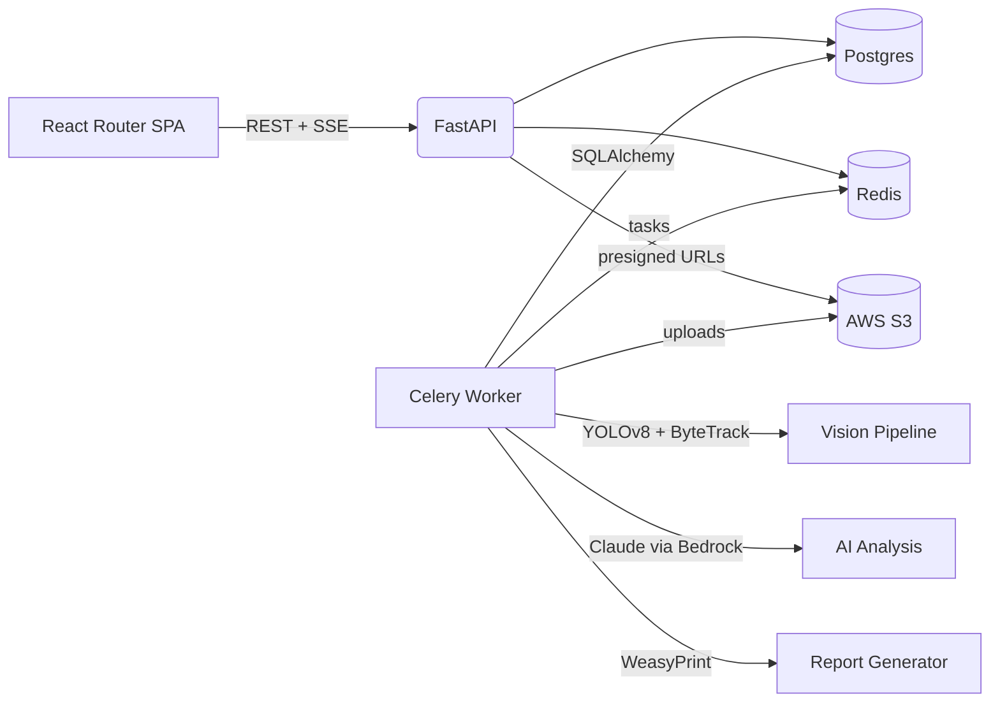

# Accident Analysis Hackathon

A 5-minute crash reconstruction assistant that turns short dashcam clips into AI-generated reports.

## Demo


> Replace with a short demo GIF or link to the recording. A 10–15s screen capture that walks through the upload → analysis → PDF flow sells the story fast.

## Problem Statement

Investigators and traffic engineers spend hours scrubbing raw footage and building collision timelines by hand. That delay slows down roadway fixes and claim resolution, especially when all they have is a short, shaky clip.

## Solution Overview

We built an end-to-end assistant that ingests a sub-5-second crash snippet, calibrates the camera against the real world, runs real-time detections to recover vehicle speeds, and hands judges a natural-language narrative plus PDF report. The system is designed to be judge-friendly: the workflow is guided, and all heavy lifting happens automatically in the background.

## Key Features

- Guided five-step project workflow that enforces video upload, key-frame extraction, geolocation, and homography calibration before processing.
- YOLOv8 + ByteTrack + Kalman smoothing pipeline that tracks vehicles, converts trajectories to world coordinates, and estimates mph using the homography solve.
- AI accident analyst powered by AWS Bedrock Claude that streams its reasoning via SSE, builds a timeline, injects weather context, and flags the collision frame.
- One-click PDF report generation that captures the impact frame, draws a map overlay, and packages the LLM narrative for judges.
- Visual review tools: interactive video player with track filtering, speed overlays, and synchronized map animation for filtered detections.

## Architecture

- React Router + Mantine frontend handles auth, project workflow, annotation tooling, and SSE event consumption.
- FastAPI backend exposes REST APIs, manages auth/projects, presigns S3 media, and orchestrates homography/processing state.
- Celery worker to run the vision pipeline, invoke Agent to decide workflows, and assemble PDF artifacts.
- PostgreSQL stores projects, detections, artifacts, and analysis results; AWS S3 holds raw videos, frames, JSONL detections, annotated exports.
- Redis brokers Celery tasks and fan-outs LLM events so the frontend can stream status updates in real time.



## Tech Stack

- Python 3.11, FastAPI, SQLAlchemy ORM, Pydantic for the backend service.
- Celery + Redis for long-running video jobs, YOLOv8s and ByteTrack via supervision/ultralytics, Kalman smoothing utilities.
- AWS S3 for media storage, WeasyPrint for PDF rendering, boto3 + AWS Bedrock Claude for LLM analysis.
- React Router v7, TypeScript, Mantine UI, Vite, and TanStack Query on the frontend.
- PostgreSQL 17 for persistence; uv package manager to make dependency management and scripts reproducible.

## Getting Started

1. **Prerequisites**
   - Python 3.11+
   - [uv](https://docs.astral.sh/uv/) for Python env management
   - Node 20+ with `pnpm`
   - Docker (optional) if you prefer `docker compose`
   - AWS credentials with S3 access, and a Google Maps API key
2. **Configure environment**
   - Copy `backend/.env` to the project root `.env` (or export the variables) and update:
     - `POSTGRES_*` for your database
     - `AWS_ACCESS_KEY_ID`, `AWS_SECRET_ACCESS_KEY`, `AWS_REGION`, `AWS_S3_BUCKET`
     - `GOOGLE_MAP_API_KEY`
     - `FIRST_SUPERUSER` / `FIRST_SUPERUSER_PASSWORD` for seed login credentials
3. **Backend**
   ```bash
   cd backend
   uv sync --all-extras
   source .venv/bin/activate
   ./scripts/dev.sh up  # starts FastAPI on :8000 and the Celery worker
   ```
4. **Frontend**
   ```bash
   cd frontend
   pnpm install
   pnpm dev  # runs on http://localhost:5173
   ```
5. **Optional: Docker Compose**
   ```bash
   docker compose up --build
   ```

## Usage

- Open `http://localhost:5173` and log in with the seeded superuser (default `admin@example.com / changethis`).
- Create a project, upload a sub-5-second collision clip, and wait for the automatic key-frame extraction.
- Use the map-assisted homography tool to pin the camera location and align points between the video still and the map; solve the homography once you have at least four high-quality pairs.
- Launch video processing: Celery tracks vehicles, computes speeds in mph, stores detections in PostgreSQL, and drops JSONL/annotated video artifacts in S3.
- Filter the detections to the relevant track IDs inside the annotation viewer, then start the “AI Accident Analysis” panel to stream Claude’s reasoning and final narrative.
- When satisfied, generate a PDF report; the worker captures the impact frame, draws the trajectory overlay, renders the LLM report, and returns a downloadable presigned URL.

## Data Sources

- User-uploaded dashcam or CCTV clips (stored privately in your S3 bucket).
- Derived metadata: detection JSONL files, annotated MP4s, impact screenshots, and homography matrices produced by the pipeline.
- Weather context is currently synthesized with realistic values until a weather API key is provided (to save money I decided not to purchase the API usage).

## Model / Algorithm Details

- **Detection & Tracking:** Ultralytics YOLOv8s with ByteTrack multi-object tracking tuned for short clips; Kalman smoothing stabilizes boxes and trajectories.
- **Spatial Calibration:** Homography solve between the extracted video frame and geospatial coordinates chosen via Google Maps; enables pixel-to-meter conversion and mph estimates.
- **Speed Estimation:** (Dramatic accuracy improvement) DistanceEstimator converts tracked bottom-centre points to world coordinates, applies smoothing, and clamps unreasonable speeds.
- **AI Narrative:** AWS Bedrock Claude Sonnet with a custom toolchain (`load_detections`, `compute_pair_metrics`, `trace_impact_window`, `build_timeline`, `report_assumptions`, `get_weather_data`) to produce a plain-language timeline.
- **Reporting:** Collision frame detection plus WeasyPrint templating to package the narrative, screenshots, and metadata into a judge-friendly PDF.

## Results & Metrics

- Sample hackathon clip (`backend/src/common/features/process_video/detections.jsonl`) tracks two vehicles (IDs 7 & 14), measures peak speeds of ~27 mph and ~25 mph, and flags the collision around frame 49 (≈1.6 s).
- End-to-end processing of a 4.9 s, 150-frame clip completes in under a minute on a local CPU/UVicorn setup, excluding LLM latency.
- The generated PDF bundles the AI narrative, impact screenshot, and trajectory map overlay, making it ready to drop into judge submissions.

## Challenges & Learnings

- Building a reliable homography UX required combining Google Maps markers with normalized video coordinates and automatic frame extraction.
- Streaming Claude’s reasoning via Redis + SSE forced us to harden the event schema and add thoughtful frontend state management.
- Low-resolution clips (<5 s) necessitated aggressive bounding-box and speed smoothing to prevent noisy mph spikes.
- Should have started with high-res cctv clips to detect crosswalk and traffic light to enrich the event timeline (I started a very difficult one, didn't have time to finish all the image enhancing techniques like edge detection...)

## Roadmap / Next Steps

- Support longer clips and batch ingestion with GPU acceleration.
- Integrate live weather and traffic APIs instead of synthetic data.
- Auto-suggest track IDs based on collision likelihood and confidence heuristics.
- Auto-detect traffic light state and give a likely causal relationship of the accident (most likely whose fault?)
- Add calibration health checks (reprojection heatmaps) and allow multiple camera views per project.

## Team

- Shuai Ma — full-stack + computer vision + product vision ([@shuaima](https://github.com/pizzashuai))

## License

Released under the [MIT License](./LICENSE).

## Credits

Special thanks to me making mistakes on my startup and having to pivot, giving me time to reflect and hack this hackathon.
